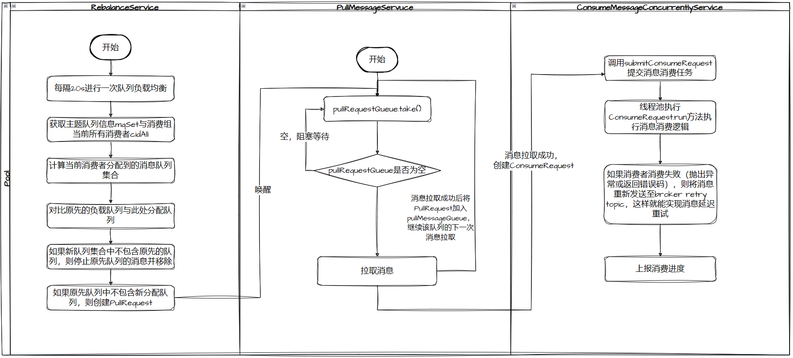

# RocketMQ 源码分析

## 消息存储

## 消息拉取与消费

- 消息拉取代码入口：org.apache.rocketmq.client.impl.consumer.PullMessageService.run
  - RocketMQ 消费者API层面分为推模式和拉模式两种消费模式，但是底层都是使用的拉模式实现的消息拉取，如果使用的推模式API，RocketMQ Client会使用长轮询的方式拉取消息，将录取到的消息放入 `ProcessQueue` 本地队列中供消费者消费。

- 消息队列负载均衡代码入口：org.apache.rocketmq.client.impl.consumer.RebalanceService.run
  - 主要为了实现消息队列负载与重新分布机制。RebalanceService会在第一次启动时计算当前节点消费的topic的队列ID，然后创建PullRequest拉取消息

- 消息消费代码入口：org.apache.rocketmq.client.impl.consumer.ConsumeMessageConcurrentlyService.ConsumeRequest.run

