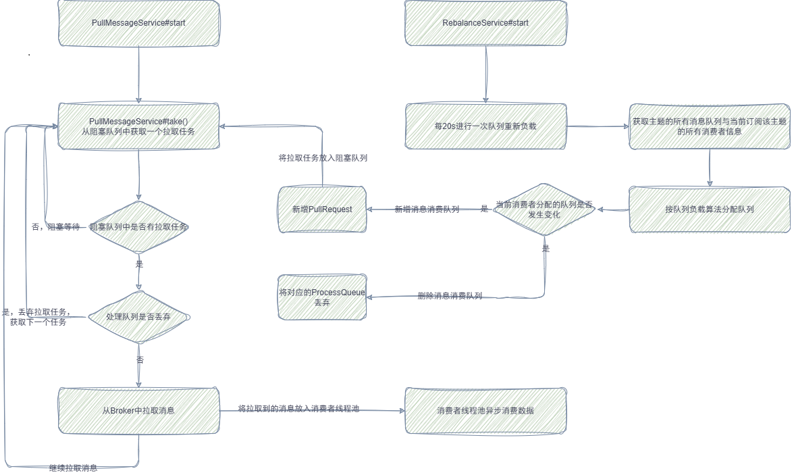

# RocketMQ 源码分析

## 消息存储
- 文件内存映射：org.apache.rocketmq.store.MappedFileQueue
  - 消息存储文件：org.apache.rocketmq.store.CommitLog
  - 消息队列索引：org.apache.rocketmq.store.ConsumeQueue
  - 消息属性索引文件：org.apache.rocketmq.store.index.IndexFile
- 消息刷盘机制：org.apache.rocketmq.store.CommitLog#handleDiskFlush
- 消息存储流程：org.apache.rocketmq.store.DefaultMessageStore#putMessage
> 参考文章：[详解RocketMQ消息存储原理](https://blog.bigcoder.cn/archives/17b04280)
- 事务消息：org.apache.rocketmq.broker.transaction.TransactionalMessageService
> 参考文章：[RocketMQ事务消息源码解析](https://github.com/bigcoder84/study-notes/blob/master/%E5%88%86%E5%B8%83%E5%BC%8F%E4%B8%8E%E5%BE%AE%E6%9C%8D%E5%8A%A1/MessageQueue/RocketMQ/subfile/_13RocketMQ%E4%BA%8B%E5%8A%A1%E6%B6%88%E6%81%AF.md)

## 消息拉取与消费

- 消息拉取代码入口：org.apache.rocketmq.client.impl.consumer.PullMessageService.run
  - RocketMQ 消费者API层面分为推模式和拉模式两种消费模式，但是底层都是使用的拉模式实现的消息拉取，如果使用的推模式API，RocketMQ Client会使用长轮询的方式拉取消息，将录取到的消息放入 `ProcessQueue` 本地队列中供消费者消费。

- 消息队列负载均衡代码入口：org.apache.rocketmq.client.impl.consumer.RebalanceService.run
  - 主要为了实现消息队列负载与重新分布机制。RebalanceService会在第一次启动时计算当前节点消费的topic的队列ID，然后创建PullRequest拉取消息

- 消息消费代码入口：org.apache.rocketmq.client.impl.consumer.ConsumeMessageConcurrentlyService.ConsumeRequest.run

- 消息消费进度
  - client端存储接口：org.apache.rocketmq.client.consumer.store.OffsetStore
    - 集群模式消息消费进度存储：org.apache.rocketmq.client.consumer.store.RemoteBrokerOffsetStore
      - 集群模式下消费进度存储在broker中
    - 广播模式消息消费进度存储： org.apache.rocketmq.client.consumer.store.LocalFileOffsetStore
      - 广播模式下消费进度存储在消费者实例本地
  - broker端存储接口：org.apache.rocketmq.broker.offset.ConsumerOffsetManager
- 定时消息代码入口：org.apache.rocketmq.store.schedule.ScheduleMessageService
- 消息过滤代码入口：org.apache.rocketmq.store.DefaultMessageStore.getMessage、org.apache.rocketmq.broker.filter.ExpressionMessageFilter
- 顺序消息消费代码入口：org.apache.rocketmq.client.impl.consumer.ConsumeMessageOrderlyService
- 事务消息代码入口：
  - 生产者入口：org.apache.rocketmq.client.impl.producer.DefaultMQProducerImpl.sendMessageInTransaction
  - broker处理事务消息入口：org.apache.rocketmq.broker.transaction.queue.TransactionalMessageServiceImpl.prepareMessage
  - broker处理事务消息确认/回滚入口：org.apache.rocketmq.broker.processor.EndTransactionProcessor.processRequest
  - broker事务状态定时回查入口：org.apache.rocketmq.broker.transaction.TransactionalMessageCheckService.onWaitEnd
- 消息轨迹：org.apache.rocketmq.client.trace.hook.SendMessageTraceHookImpl、org.apache.rocketmq.client.trace.hook.ConsumeMessageTraceHookImpl

> 参考文章：[RocketMQ源码分析](https://github.com/bigcoder84/study-notes/blob/master/%E5%88%86%E5%B8%83%E5%BC%8F%E4%B8%8E%E5%BE%AE%E6%9C%8D%E5%8A%A1/MessageQueue/RocketMQ/index.md)

## 高可用

- broker主从同步启动入口：org.apache.rocketmq.store.ha.HAService.start
  - 主服务器监听从服务器连接实现类：org.apache.rocketmq.store.ha.HAService.AcceptSocketService

## 基于Raft协议的主从同步和故障切换
